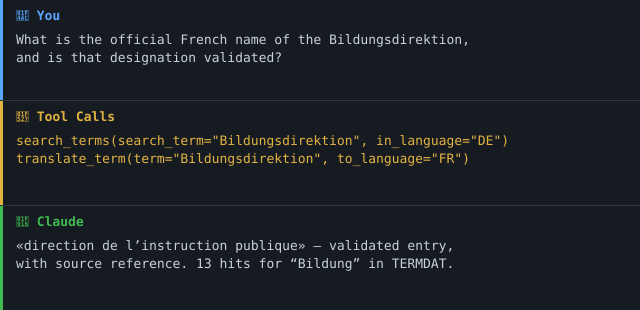

> 🇨🇭 Teil des [**Swiss Public Data MCP Portfolio**](https://github.com/malkreide/swiss-public-data-mcp) — Open-Source-MCP-Server, die KI-Agenten mit Schweizer Behörden- und Open-Data-Quellen verbinden.
> Dies ist ein privates Projekt. Es ist unabhängig von jeder Arbeitgeberin und jeder institutionellen Zugehörigkeit.

# 🏷️ termdat-mcp

[](CHANGELOG.md)
[](https://github.com/malkreide/termdat-mcp/actions/workflows/ci.yml)
[](LICENSE)
[](https://www.python.org/)
[](https://modelcontextprotocol.io/)
[](#architektur-entscheid)
[](https://github.com/malkreide/swiss-public-data-mcp)

> Amtliche, validierte Schweizer Verwaltungsbenennungen in DE / FR / IT / EN — mit Quellenangabe und Validierungsstatus.

[🇬🇧 English Version](README.md)

## Übersicht

MCP-Server für **TERMDAT**, die Terminologiedatenbank der Bundesverwaltung, geführt von der Schweizerischen Bundeskanzlei. Er gibt einem KI-Agenten die amtlich validierten Benennungen von Schweizer Behörden, Departementen und Erlassen in DE / FR / IT / EN — mit Quellenangabe und Validierungsstatus.

Gefunden über [`i14y-mcp`](https://github.com/malkreide/i14y-mcp), das TERMDAT als Datendienst `ff0c37eb-2f7c-4ff6-996e-d22b77bf52fc` verzeichnet.

**Was das ist — und was nicht.** TERMDAT ist kein Fachlexikon. Es ist ein **beglaubigtes Namensschild-Archiv**: Es sagt nicht, was «Sonderpädagogik» bedeutet — aber es sagt, wie die dafür zuständige Behörde amtlich heisst und wie sie auf Französisch heisst.

Gemessene Abdeckung (live, 19.07.2026, Suche auf Deutsch über das Feld Terminus):

| Suchbegriff | Treffer |
|---|---|
| Departement | 20 |
| Bildung | 13 |
| Verordnung | 8 |
| Schule | 5 |
| Behörde | 4 |
| Sonderpädagogik | 3 |
| Volksschule · Lehrperson · Schulleitung · Unterricht · Kindergarten | **0** |

Die dreizehn «Bildung»-Treffer sind Organisationsbezeichnungen — Bildungsdirektion, Erziehungsdepartement, Departement für Volkswirtschaft und Bildung —, keine pädagogischen Begriffe. Entsprechend planen: Dieser Server ist stark bei **Behördennamen, amtlichen Titeln und Abkürzungen** und weitgehend stumm bei Fachterminologie.

## Funktionen

- Sieben Read-only-Tools über die offizielle öffentliche TERMDAT-v2-API.
- Amtliche Benennungen in **DE / FR / IT / EN**, mit Quellenangabe und Validierungsstatus in jeder Antwort.
- Kommunikations-QA: bis zu 25 Begriffe in einem Aufruf gegen validierte Benennungen prüfen.
- Vokabular-Cache (24 h TTL) für die 140 Sammlungen und 23 Klassifikationen, mit Stale-Serve-Fallback.
- Retry mit exponentiellem Backoff (2/4/8 s); explizites `MaxEntryCount`, um stille Kürzung zu vermeiden.
- Dual-Transport: `stdio` (lokal) und SSE (Cloud).
- Keine Authentifizierung nötig — öffentliche, unauthentifizierte API (No-Auth-First).

## 🎯 Anchor Demo Query

> *«Wie heissen die für Bildung zuständigen Direktionen der Deutschschweizer Kantone offiziell auf Französisch und Italienisch?»*

Aufgelöst über `list_classifications` → `search_terms` → `translate_term`.

### Demo



## Voraussetzungen

- Python 3.10+
- [`uv` / `uvx`](https://docs.astral.sh/uv/) (empfohlen) oder `pip`
- Netzwerkzugriff auf `api.termdat.bk.admin.ch` — kein API-Key nötig

## Installation

```bash
uvx termdat-mcp
```

Claude Desktop (`claude_desktop_config.json`):

```json
{
  "mcpServers": {
    "termdat": {
      "command": "uvx",
      "args": ["termdat-mcp"]
    }
  }
}
```

## Quickstart

```bash
# Lokal über stdio (Standard-Transport)
uvx termdat-mcp

# Aus einem Checkout, ohne Installation
PYTHONPATH=src python -m termdat_mcp
```

## Konfiguration

Die gesamte Konfiguration läuft über Umgebungsvariablen. Die Defaults sind für den lokalen Betrieb sicher.

| Variable | Default | Zweck |
|---|---|---|
| `TERMDAT_MCP_TRANSPORT` | `stdio` | Transport: `stdio` (lokal) oder `sse` / `streamable-http` / `http` (Cloud) |
| `HOST` | `127.0.0.1` | Bind-Host (nur SSE-Transport). Standardmässig Loopback; `HOST=0.0.0.0` **nur** im Container setzen |
| `PORT` | `8000` | Bind-Port (nur SSE-Transport) |
| `TERMDAT_MCP_CORS_ORIGINS` | `[]` | Nur SSE: explizit erlaubte Browser-Origins (Default-Deny; in Produktion nie Wildcard) |
| `TERMDAT_MCP_LOG_LEVEL` | `INFO` | structlog-Level (JSON auf stderr) |
| `TERMDAT_MCP_VOCAB_TTL` | `86400` | TTL des Vokabular-Caches in Sekunden |

Die Konfiguration wird einmalig in ein typisiertes `Settings`-Objekt (pydantic-settings) geladen.

Cloud (Render / Railway):

```bash
TERMDAT_MCP_TRANSPORT=sse PORT=8000 termdat-mcp   # exponiert /sse
```

## Verfügbare Tools

| Tool | Zweck |
|---|---|
| `search_terms` | Suche mit Feld-Flags, Sammlungs- und Klassifikationsfiltern |
| `translate_term` | Amtliche Entsprechung eines Verwaltungsbegriffs in einer anderen Landessprache |
| `check_terms` | Kommunikations-QA: bis zu 25 Begriffe gegen validierte Benennungen prüfen |
| `get_entries` | Bekannte Einträge über die numerische ID holen |
| `list_collections` | Die rund 140 Terminologie-Sammlungen (Filterwerte) |
| `list_classifications` | Die 23 Sachklassifikationen, z. B. `BILD` = Bildung |
| `api_status` | Verfügbarkeit; liefert nie stillschweigend leer |

Alle Tools sind mit `readOnlyHint: true` und `destructiveHint: false` annotiert.

**MCP-Primitive.** Dieser Server nutzt ausschliesslich das **Tools**-Primitive.
TERMDAT-Antworten sind Live-Abfragen ohne stabile Ressourcen-Hierarchie für
*Resources*, und es gibt keine server-eigenen *Prompts*. Die sieben Tools sind
klein und eng verwandt und liegen daher in einer einzigen `server.py` statt in
einem `tools/`-Paket.

## Architektur

```
┌─────────────────┐   stdio / SSE    ┌──────────────────────────┐
│  MCP-Host       │ ───────────────► │  termdat-mcp             │
│  (Claude, IDE)  │ ◄─────────────── │                          │
└─────────────────┘                  │  Vokabular-Cache (24 h)  │
                                     │  140 Sammlungen          │
                                     │   23 Klassifikationen    │
                                     └────────────┬─────────────┘
                                                  │ httpx + Retry (2/4/8 s)
                                                  ▼
                              https://api.termdat.bk.admin.ch/v2
                              ├── /Search          (SearchTerm + InLanguageCode)
                              ├── /Entry           (EntryIds)
                              ├── /Collection      (140 Werte)
                              └── /Classification  ( 23 Werte, inkl. BILD)
```

## Architektur-Entscheid

Dieser Server nutzt **Architektur A (Live-API-only)**, mit Caching nur für die beiden kontrollierten Vokabulare.

Begründung (live verifiziert am 19.07.2026):

- Die API publiziert eine vollständige **OpenAPI-3.0.4-Spezifikation** unter `/swagger/v2/swagger.json` und deklariert **keine Security-Schemes** — unauthentifizierter Zugriff, No-Auth-First erfüllt.
- Die serverseitige Suche funktioniert sauber, inklusive 11 Feld-Flags und Filtern nach Sammlung und Klassifikation. Es gibt keinen Grund, die Datenbank lokal zu spiegeln, und es wird kein Bulk-Dump angeboten.
- `/Collection` (140 Einträge) und `/Classification` (23 Einträge) ändern selten und werden gebraucht, damit Filterargumente für einen Agenten lesbar sind. Sie werden mit 24-Stunden-TTL gecacht, mit Stale-Serve-Fallback.

Konsequenzen:

- Jede Suche ist ein Live-Call; `provenance` ist `live_api` ausser bei Vokabular-Abfragen.
- Validierungsfehler kommen als saubere RFC-9110-Payloads und werden weitergereicht statt verschluckt.

## Projektstruktur

```
termdat-mcp/
├── src/termdat_mcp/
│   ├── __init__.py
│   ├── __main__.py       # Einstiegspunkt; Dual-Transport (stdio / SSE)
│   ├── client.py         # httpx-Client, Retry, Vokabular-Cache
│   ├── models.py         # Pydantic-Modelle
│   └── server.py         # MCP-Tool-Definitionen
├── tests/
│   ├── test_client.py    # offline, respx-gemockt
│   └── test_live.py       # gegen die echte TERMDAT-API
├── README.md
├── README.de.md
├── CHANGELOG.md
├── LICENSE
└── pyproject.toml
```

## Sicherheit & Grenzen

- **Read-only.** Jedes Tool ist mit `readOnlyHint: true` und `destructiveHint: false` annotiert; der Server schreibt nie nach TERMDAT.
- **Keine Credentials.** Die API ist unauthentifiziert; der Server speichert und übermittelt keine Geheimnisse.
- **Keine stillen Leermengen.** `api_status` und Fehlerpfade legen Ausfälle offen, statt ein leeres Resultat zu liefern, das vollständig aussieht.
- **Kürzung ist explizit.** `MaxEntryCount` wird immer gesendet und `truncated` gemeldet (siehe Bekannte Einschränkungen).
- **Lizenz-Vorbehalt.** TERMDAT-Inhalte tragen keine Lizenzangabe; jede Antwort wiederholt das im Feld `source`. Vor Weiterveröffentlichung die Bedingungen mit der Bundeskanzlei klären.
- **Egress-Allow-List.** Anfragen erreichen nur `api.termdat.bk.admin.ch` (HTTPS), vor jedem Aufruf durch ein eingefrorenes `ALLOWED_HOSTS`-Set erzwungen — kein Nutzer-Input kann den Egress umlenken. Siehe [`docs/network-egress.md`](docs/network-egress.md).
- **Loopback als Default.** SSE bindet an `127.0.0.1`; `0.0.0.0` ist ein expliziter Container-Opt-in mit stderr-Warnung. SSE setzt zudem Default-Deny-CORS und exponiert nur `Mcp-Session-Id`.
- **Fehler werden maskiert.** Upstream-/interne Fehlerdetails gehen als structlog-JSON auf stderr und werden nie an das Modell zurückgegeben.
- **Akzeptierte Risiken (ADRs):** DNS-Pinning ([ADR 0001](docs/adr/0001-dns-pinning.md)) und Stateful Load Balancing ([ADR 0002](docs/adr/0002-scaling-and-deployment.md)) sind bewusst zurückgestellt — geringes Risiko bei Single-Instance, Single-Host, ohne Auth.
- **Container.** Ein gehärtetes, non-root [`Dockerfile`](Dockerfile) liegt für SSE-Deployments bei.

## Bekannte Einschränkungen

- **Nur Verwaltungsterminologie.** Siehe Abdeckungstabelle oben. `check_terms` liefert `not_found`, nie «falsch» — genau weil Fehlen in TERMDAT kein Fehlerbeleg ist.
- **`MaxEntryCount` hat einen stillen Default von rund 25.** Ohne den Parameter sieht das Resultat vollständig aus. Dieser Server sendet ihn immer explizit und meldet `truncated`.
- **`CollectionIds` / `ClassificationIds` haben einen stillen Default auf `VARIA`.** Eine Suche ohne IDs deckt **1 von 23** Sachgebieten ab — ausgerechnet die Restkategorie — und meldet das verkürzte Ergebnis als ganz normale Leermenge. Dieser Server sendet alle Klassifikationen, sofern du nicht explizit einschränkst. Siehe [Issue #11](https://github.com/malkreide/termdat-mcp/issues/11).
- **`SearchTerm` ist Lucene, und gematcht wird auf ganzen Wörtern.** «Quellensteuer» findet «Quellensteuerverordnung» nicht, «Quellensteuer*» schon. `*`, `?` und `~` stehen zur Verfügung — bei einem leeren Resultat zuerst mit Wildcard nachfassen, bevor man auf Abwesenheit schliesst.
- **Nicht gesendete `Field.*`-Flags stehen serverseitig auf true.** `Terminus`, `Name`, `Abbreviation` und `Phraseology` sind aktiv, solange sie nicht explizit deaktiviert werden — ein unvollständiges Flag-Set kann eine Suche also nur erweitern, nie verengen. Dieser Server sendet alle elf Flags explizit; erst dadurch wirkt `fields` einschränkend.
- **Mehrsprachige Varianten sind Opt-in.** Ohne `OutLanguageCode` kommen nur die deutschen Benennungen; und sie erscheinen nur bei `ReturnType=Detail`. `translate_term` setzt beides für dich.
- **Die öffentliche API liefert weniger als die Website.** Keine Scope-Einstellung, sondern eine Abdeckungsgrenze der Quelle. Für «Quellensteuer» zeigt die Website 12 verschiedene Einträge, die API liefert bei maximalem Recall 7 (alle Sprachen, alle 11 Felder, Infix-Wildcard, alle Klassifikationen und Sammlungen). Die Überschneidung beträgt **einen** Eintrag, 447912. Ein direkter Abruf der fehlenden IDs über `/v2/Entry` gibt HTTP 200 mit leerem Body zurück — sie werden gar nicht ausgeliefert, also erreicht sie keine Query. Eine Ausnahme, 1557, wird ausgeliefert, trägt aber den Status `In Bearbeitung` in einer Sammlung mit dem Zusatz «(aufgehoben)». Das legt nahe, dass der Suchindex validierte Einträge abdeckt, während die Website auch Entwürfe und aufgehobenes Material zeigt. Folge: Fehlt ein Begriff in diesem Server, fehlt er in der **API** — nicht in TERMDAT. Verifiziert am 30.07.2026 anhand der Entry-IDs, die @dfch in [Issue #11](https://github.com/malkreide/termdat-mcp/issues/11) geliefert hat; eher ein Fall für eine Rückfrage bei der Bundeskanzlei als für einen Workaround.
- **Keine Lizenzangabe.** Der I14Y-Katalogeintrag führt `license: null`. Vor jeder Weiterveröffentlichung von TERMDAT-Inhalten die Bedingungen mit der Bundeskanzlei klären. Jede Antwort wiederholt das im Feld `source`.
- **Sprachabdeckung variiert pro Eintrag.** Nicht jeder Eintrag existiert in allen vier Sprachen; `translate_term` lässt Einträge ohne Zielsprache weg, statt etwas zu erfinden.

### Befunde der Live-Probe (19.07.2026)

| Endpoint | HTTP | Status | Bemerkung |
|---|---|---|---|
| `/swagger/v2/swagger.json` | 200 | ✅ | OpenAPI 3.0.4, 132 KB, `securitySchemes: []` |
| `/v2/Search` | 200 | ✅ | verlangt `SearchTerm`, `InLanguageCode`, `ReturnType` |
| `/v2/Entry` | 200 | ✅ | verlangt `EntryIds`, `InLanguageCode` |
| `/v2/Collection` | 200 | ✅ | 140 Werte |
| `/v2/Classification` | 200 | ✅ | 23 Werte, inkl. `BILD` (Bildung) |
| `/v2/` (Root) | 404 | ❌ | kein Index; der I14Y-Eintrag zeigt hierhin |
| `InLanguageCode=deu` / `de-CH` | 400 | ❌ | nur zweistellige ISO-Codes, Gross-/Kleinschreibung egal |

**Probe-Notiz: eine Korrektur, die festgehalten gehört.** Eine frühere Probe schloss, `OutLanguageCode` **filtere** die Treffermenge, weil mit dem Parameter alle Treffer verschwanden. Das stimmt nicht. Es wurden zwei Variablen gleichzeitig geändert — der Parameter und der Suchbegriff —, und der Begriff selbst («Volksschule») hat schlicht null Treffer. Danach über vier breite Begriffe verifiziert: Die Trefferzahl ist mit und ohne `OutLanguageCode` identisch, der Parameter ist rein additiv. Ein Regressionstest (`test_out_language_is_additive_not_filtering`) sichert das jetzt ab.

**Faustregel:** *Pro Probe-Call nur eine Variable ändern — sonst gesteht die API eine Tat, die sie nicht begangen hat.*

### Befunde der Live-Probe (27.07.2026) — Suchraum

Gemeldet in [Issue #11](https://github.com/malkreide/termdat-mcp/issues/11): «Quellensteuer»
lieferte null Treffer, während die TERMDAT-Website zwölf zeigte. Drei unabhängige Ursachen,
absteigend nach Wirkung. Trefferzahlen mit `InLanguageCode=DE`:

| Query | ohne IDs (`=VARIA`) | alle 23 Klassifikationen | + Freitextfelder | + `*`-Wildcard |
|---|---|---|---|---|
| `Quellensteuer` | 0 | 1 | 3 | 6 |
| `Pensionskasse` | 1 | 4 | 22 | 27 |

Die erste Spalte ist das, was dieser Server vor dem Fix gesendet hat. Der `VARIA`-Default
dominiert: Er hat `FINANZWESEN`, `RECHT` und zwanzig weitere Sachgebiete hinter einer
Antwort versteckt, die wie eine belastbare Null aussah.

**Probe-Notiz.** Festhaltenswert ist nicht die Trefferzahl, sondern dass eine zu eng
gefasste Suche von echter Abwesenheit nicht unterscheidbar ist. In der gemeldeten Session
las das Modell das leere Resultat zusammen mit dem hauseigenen Hinweis «Fehlen heisst meist
ausserhalb des Scopes» — und erfand eine plausible Erklärung für einen Begriff, der die
ganze Zeit in der Datenbank stand. Einem Werkzeug, das stillschweigend einschränkt, wird
stillschweigend geglaubt. Daher `hint` bei Leermengen und ein Caveat, das dem Modell jetzt
sagt, es solle nachfassen statt schliessen.

## Projektphase

Dieser Server ist in **Phase 1 (read-only)**. Alle Tools sind mit
`readOnlyHint: true` / `destructiveHint: false` annotiert und fragen
ausschliesslich die öffentliche TERMDAT-v2-API ab — es gibt keine Schreib-,
Sende- oder Dateisystem-Fähigkeiten.

| Phase | Umfang | Status |
|---|---|---|
| **1 — Read-only** | Verwaltungsbenennungen suchen, übersetzen und prüfen | ✅ aktuell |
| 2 — Schreibfähig | (nicht geplant) | — |
| 3 — Multi-Agent | (nicht geplant) | — |

Ein Übergang in eine spätere Phase würde ein Re-Audit und Human-in-the-Loop-
Kontrollen erfordern, bevor ein schreibfähiges Tool hinzukommt.

## MCP-Protokoll-Version

Die Protokollversion wird beim `initialize`-Handshake vom
[`mcp`](https://pypi.org/project/mcp/)-Python-SDK ausgehandelt (in
`pyproject.toml` auf `>=1.2.0` gepinnt). Das SDK wird über monatliche
Dependabot-PRs aktuell gehalten (`.github/dependabot.yml`);
protokollrelevante Bumps werden in [`CHANGELOG.md`](CHANGELOG.md) vermerkt.

## Testing

```bash
PYTHONPATH=src pytest tests/ -m "not live"   # offline, respx-gemockt
PYTHONPATH=src pytest tests/ -m live         # gegen die echte API
PYTHONPATH=src ruff check src tests
```

## Changelog

Siehe [CHANGELOG.md](CHANGELOG.md).

## Mitwirken

Issues und Pull Requests sind willkommen. Bitte Tools read-only halten, vor dem Einreichen `ruff check` und die Offline-Testsuite laufen lassen und für nutzersichtbare Änderungen einen Eintrag unter `[Unreleased]` in der `CHANGELOG.md` ergänzen.

Maintainer: siehe [PUBLISHING.md](PUBLISHING.md) für den Schritt-für-Schritt-PyPI-Release-Prozess (Trusted Publishing via GitHub Release).

## Sicherheit

Siehe [SECURITY.md](SECURITY.md) für Sicherheits-Posture, Härtungskontrollen und wie Schwachstellen gemeldet werden.

## Lizenz

MIT für diesen Server — siehe [LICENSE](LICENSE). Die TERMDAT-Inhalte unterliegen den Bedingungen der Bundeskanzlei.

## Autor

**Hayal Oezkan** · [github.com/malkreide](https://github.com/malkreide)

## Credits & verwandte Projekte

- Daten: [TERMDAT](https://www.termdat.bk.admin.ch/), Schweizerische Bundeskanzlei (BK).
- Katalogeintrag: [I14Y-Datendienst `ff0c37eb…`](https://www.i14y.admin.ch/de/catalog/dataservices/ff0c37eb-2f7c-4ff6-996e-d22b77bf52fc/description)
- Discovery-Server: [i14y-mcp](https://github.com/malkreide/i14y-mcp)
- Portfolio-Index: [swiss-public-data-mcp](https://github.com/malkreide/swiss-public-data-mcp)
